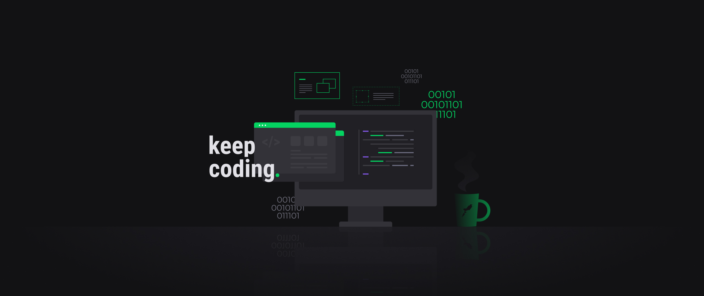
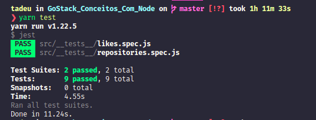

<h1 align="center">
  
</h1>

  

  
  
  

  

  <a href="https://github.com/TadeuA/GoStack_Conceitos_Com_Node/blob/master/LICENSE.md">
    
  <a>

 

---

## 💻 Desafio

Desafio node nível 1: CRUD

- [x] Clonar o repositorio com template
- [x] Rota para criar repositório
  - [x] deve receber title: string , url: string e techs: string[ ], iniciar likes: number = 0 e id:string = gerar automaticamente
  - [x] garantir que o id seja UUID
- [x] Rota para listar repositórios
- [x] Validar id nos parâmetros
- [x] Rota para alterar repositórios
  - [x] Validar pelo id se o repositório existe
  - [x] Receber likes
  - [x] Manter a quantidade de likes quando alterar algum dado no repositório
- [x] Rota para deletar repositório
  - [x] Validar pelo id se o repositório existe
- [x] passar pelo teste de fogo

<h1 align="center">
  
</h1>

---

🔨 Built by [Tadeu Agostini](https://www.linkedin.com/in/tadeuagostini/)
